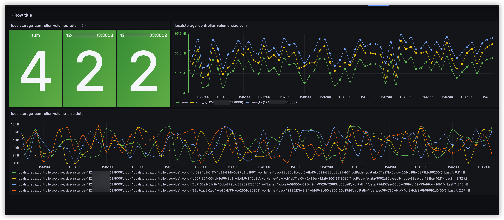

# localstorage_controller_volumes metrics

## Grafana Dashboard
A Grafana Dashboard designed for metrics from Logstash-exporter on Kubernetes is available
at [localstorage-controller-dashboard](https://grafana.com/grafana/dashboards/19251-localstorage-controller-dashboard/).
This dashboard's JSON source is
at [localstorage_controller-dashboard.json](./localstorage_controller-dashboard.json).

## Metrics
Table of exported metrics:

| Name                                    | Type  | Description                                                                            |
|-----------------------------------------|-------|----------------------------------------------------------------------------------------|
| `localstorage_controller_volumes_total` | Gauge | HELP localstorage_controller_volume_size The size of each volume in localstorage       |
| `localstorage_controller_volume_size`   | Gauge | HELP localstorage_controller_volumes_total The total number of volumes in localstorage |

## Prometheus
The Prometheus configuration to scrape metrics from Logstash-exporter on Kubernetes is available
at [prometheus.yml](./prometheus.yml).